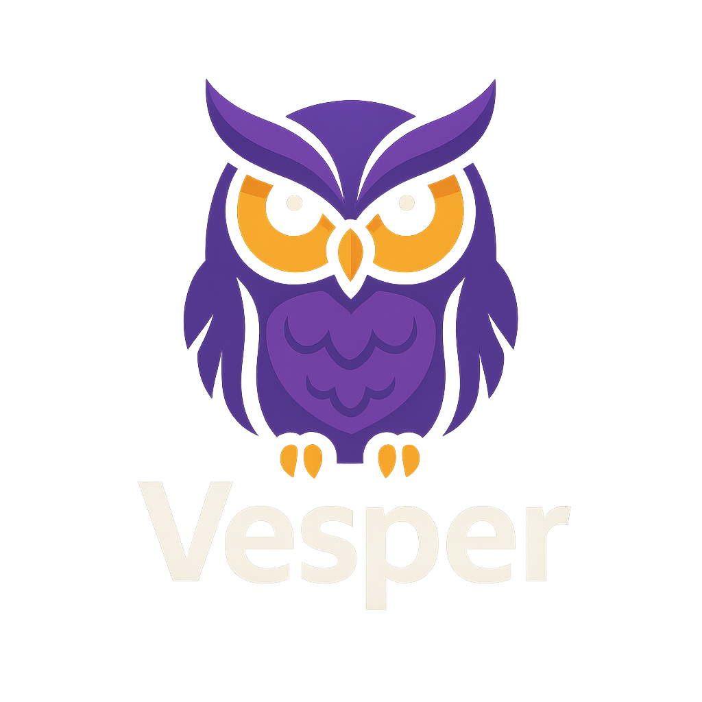

# 🌌 Vesper OS

    

**Vesper OS** es un sistema operativo experimental escrito en **Rust**, diseñado para ser **portable, ligero y persistente**, con la capacidad de ejecutar aplicaciones en formato **WebAssembly (.wasm)**.

---

## 🚀 Concepto Principal

<ul style="list-style: none; padding-left: 0;">
    <li style="position: relative; padding-left: 30px; margin-bottom: 10px;">🦉 Crear un <b>sistema operativo personalizado</b> en Rust.</li>
    <li style="position: relative; padding-left: 30px; margin-bottom: 10px;">🦉 Soporte para <b>aplicaciones WebAssembly</b> ejecutadas como programas nativos.</li>
    <li style="position: relative; padding-left: 30px; margin-bottom: 10px;">🦉 <b>Portabilidad en USB</b> con persistencia de datos (inspirado en NomadBSD, pero más ligero).</li>
    <li style="position: relative; padding-left: 30px; margin-bottom: 10px;">🦉 <b>Identidad propia</b> centrada en portabilidad y aprendizaje.</li>
</ul>

---

## 🎨 Identidad Visual

- **Nombre**: <i>Vesper</i> (estrella vespertina, elegancia nocturna).
- **Paleta de Colores**:
  

    
Negro Profundo (#0B0B0D)

    
Morado Oscuro (#2C1A47)

    
Azul Cósmico (#1E2A78)

    
Violeta Brillante (#A259FF)

    
Blanco Humo (#EAEAEA)

    
Verde Neón (#3DFFB4)

  

- **Mascota / Símbolo**:  
  - Búho minimalista 🦉, representando sabiduría, vigilancia nocturna y una identidad fuerte.

- **Logo Conceptual**:
  - **Tipografía**: Moderna y geométrica (<i>Orbitron</i> o <i>Montserrat</i>).
  - **Símbolo**: Búho o estrella vespertina estilizada en diseño plano.
  - **Estilo**: Versátil para CLI (arte ASCII) e interfaces gráficas.

---

## ✅ Progreso Actual

<ul style="list-style: none; padding-left: 0;">
    <li style="position: relative; padding-left: 30px; margin-bottom: 10px;">🦉 Configuración mínima con <b>Rust estable</b> (sin dependencia de nightly).</li>
    <li style="position: relative; padding-left: 30px; margin-bottom: 10px;">🦉 <b>Multiboot2</b> válido para arranque con GRUB2.</li>
    <li style="position: relative; padding-left: 30px; margin-bottom: 10px;">🦉 Ejemplo funcional que imprime <code>Hola</code> en modo texto VGA.</li>
    <li style="position: relative; padding-left: 30px; margin-bottom: 10px;">🦉 <b>Makefile</b> para:
        <ul style="list-style: disc; padding-left: 20px;">
            <li>Compilar el kernel.</li>
            <li>Crear ISO con GRUB2.</li>
            <li>Ejecutar en QEMU.</li>
        </ul>
    </li>
</ul>

---

## 🔧 Pendiente por Implementar

<ul style="list-style: none; padding-left: 0;">
    <li style="position: relative; padding-left: 30px; margin-bottom: 10px;">🦉 Limpieza de pantalla y control avanzado de salida VGA.</li>
    <li style="position: relative; padding-left: 30px; margin-bottom: 10px;">🦉 Manejo de interrupciones (IDT/GDT en Rust).</li>
    <li style="position: relative; padding-left: 30px; margin-bottom: 10px;">🦉 Controlador básico de teclado.</li>
    <li style="position: relative; padding-left: 30px; margin-bottom: 10px;">🦉 Sistema de archivos persistente en USB.</li>
    <li style="position: relative; padding-left: 30px; margin-bottom: 10px;">🦉 Soporte para ejecutar archivos <code>.wasm</code>.</li>
    <li style="position: relative; padding-left: 30px; margin-bottom: 10px;">🦉 Sistema de empaquetado y gestión de aplicaciones WebAssembly.</li>
    <li style="position: relative; padding-left: 30px; margin-bottom: 10px;">🦉 Logo y branding en ASCII/CLI y gráficos.</li>
</ul>

---

## 🎯 Próximos Pasos

<ol style="padding-left: 20px;">
    <li style="margin-bottom: 10px;">Mejorar salida en pantalla (drivers VGA, framebuffer).</li>
    <li style="margin-bottom: 10px;">Implementar IDT y manejo de interrupciones.</li>
    <li style="margin-bottom: 10px;">Agregar soporte para entrada de teclado.</li>
    <li style="margin-bottom: 10px;">Diseñar el logo inicial en SVG.</li>
    <li style="margin-bottom: 10px;">Probar persistencia en USB (arranque real).</li>
    <li style="margin-bottom: 10px;">Integrar soporte básico para <code>.wasm</code>.</li>
</ol>

---

## ✍️ Meta Personal

    Aprender <b>Rust</b> a profundidad, dominando tanto el desarrollo de bajo nivel (OSDev) como el de alto nivel (ejecución de WebAssembly), para crear un <b>sistema operativo único</b> con una identidad propia y sólida.

